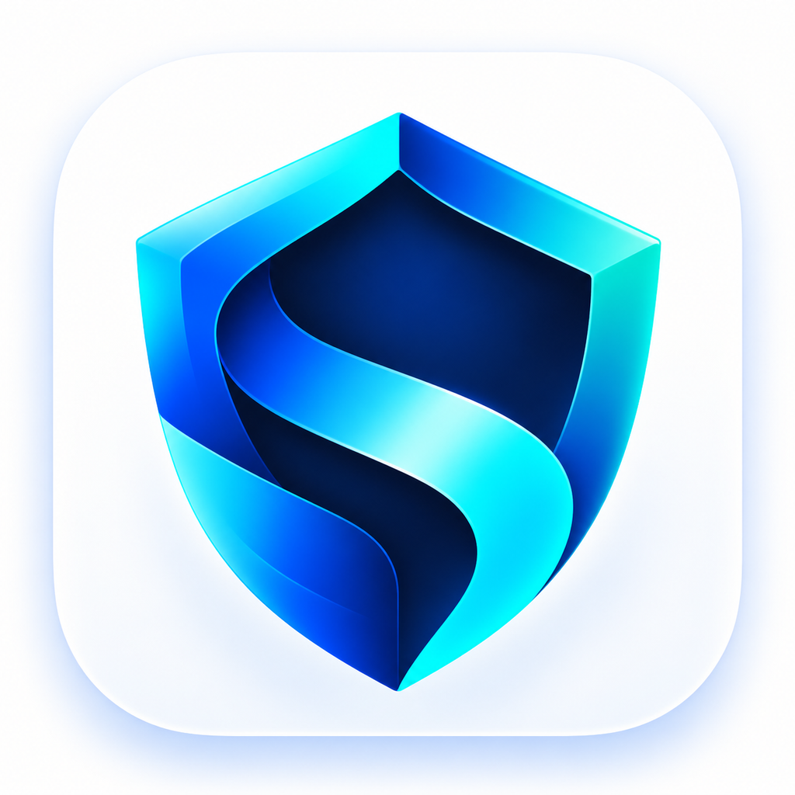
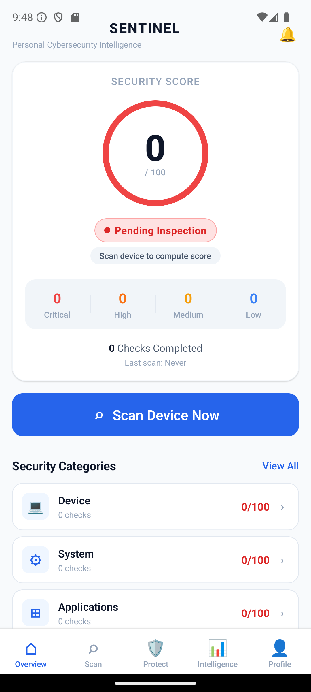
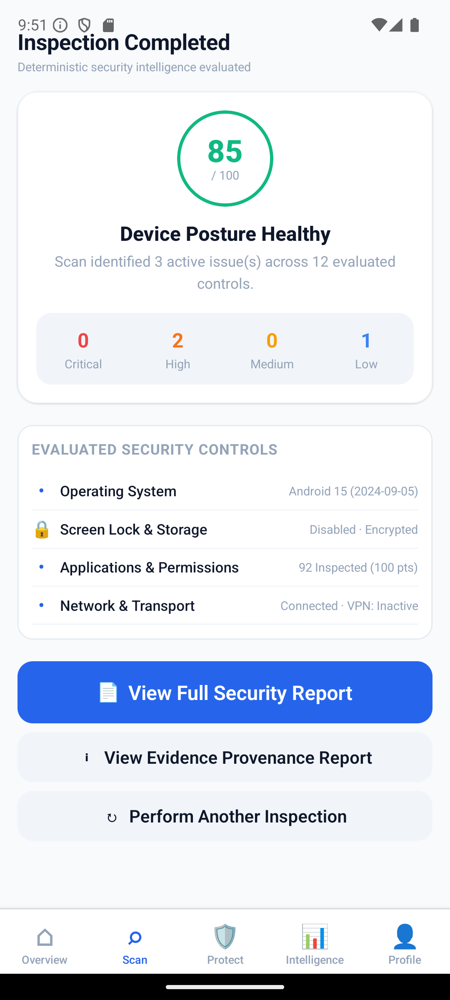
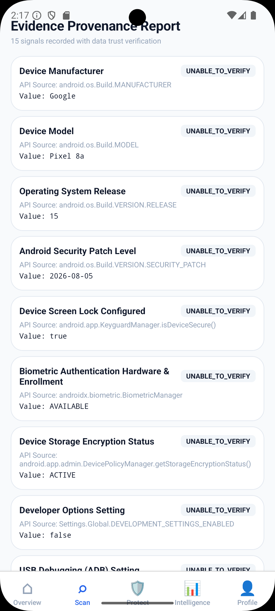
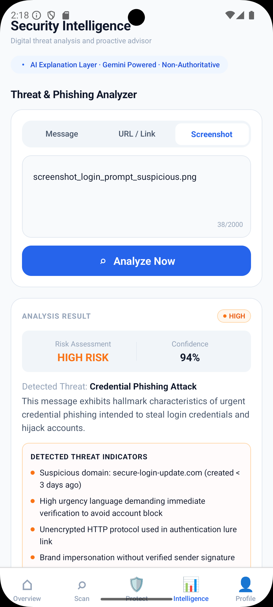
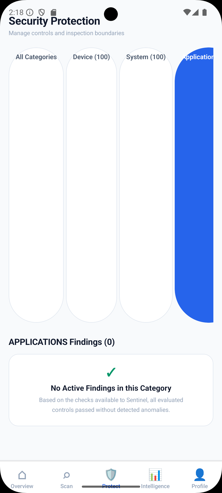
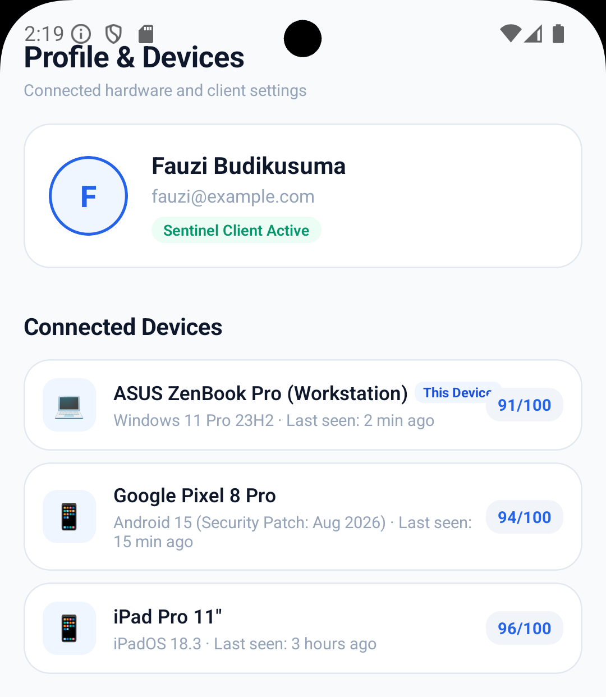
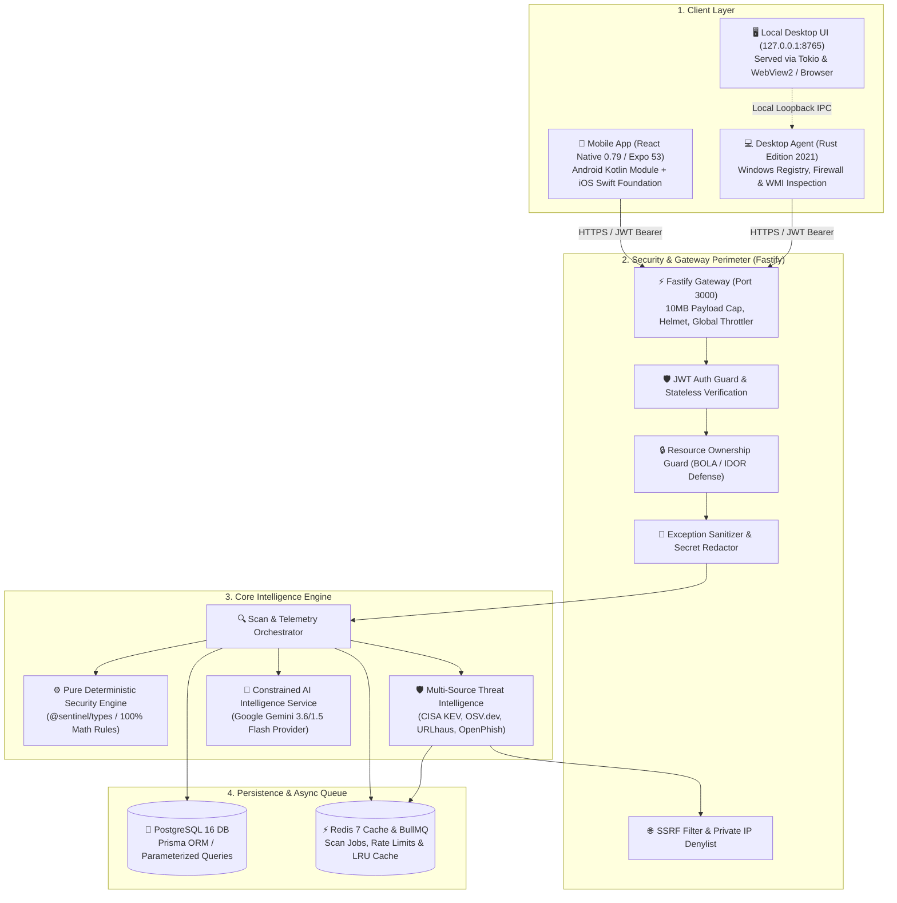

<div align="center">



# Sentinel

### Personal Cybersecurity Intelligence Platform

**Transparent, evidence-based security diagnostics, deterministic risk evaluation, multi-source threat intelligence, and privacy-preserving AI advisory.**

[](https://github.com/budikusumafauzi-sketch/sentinel/actions/workflows/ci.yml)
[](https://nodejs.org/)
[](https://pnpm.io/)
[](https://www.typescriptlang.org/)
[](https://turbo.build/)
[](https://www.rust-lang.org/)
[](https://nestjs.com/)
[](https://fastify.dev/)
[](https://www.prisma.io/)
[](https://www.postgresql.org/)
[](https://redis.io/)
[](#license)

[Overview](#-overview) • [Core Pillars](#-core-architectural-pillars) • [Product Tour](#-product-tour--visual-interface) • [Architecture](#-system-architecture) • [Platform Support](#-supported-platforms--capabilities) • [Tech Stack](#-technology-stack) • [Quick Start](#-quick-start--development) • [Security](#-security-model--hardening) • [Documentation](#-documentation-hub)

</div>

---

## 🛡️ Overview

**Sentinel** is a personal cybersecurity intelligence platform engineered to bridge the gap between complex enterprise security diagnostics and consumer personal computing. It automatically collects verifiable security signals across personal devices, evaluates security posture using strict mathematical rules, communicates platform boundaries honestly, correlates exposure with real-world threat feeds, and delivers clear, privacy-preserving remediation guidance.

Traditional personal antivirus tools frequently rely on opaque scores, exaggerated risk metrics, or silent vendor telemetry. **Sentinel takes a radically different approach:**

- **What it is:** A multi-platform personal defense suite combining a cross-platform mobile client (React Native/Expo with Kotlin/Swift native modules), a high-performance Windows desktop agent (Rust), a high-throughput Fastify/NestJS backend, and a deterministic security engine.
- **What it does:** Continuously audits hardware security, biometrics, screen lock, disk encryption, network interfaces, firewall posture, developer modes, and application permissions without compromising user privacy.
- **How it is built:** Architected as an enterprise Turborepo monorepo with strict TypeScript contracts, parameterized PostgreSQL persistence via Prisma ORM, Redis caching and BullMQ task scheduling, and isolated native agents.
- **Why it is secure:** Every security score is calculated deterministically with full provenance tracking. Missing signals are never penalized as insecure, and generative AI is strictly constrained to an advisory role—it can never manipulate security scores or ratings.

---

## 🏛️ Core Architectural Pillars

Sentinel is founded upon five non-negotiable architectural principles:

```
┌─────────────────────────────────────────────────────────────────────────┐
│                       SENTINEL CORE PHILOSOPHY                          │
├──────────────────────┬──────────────────────┬───────────────────────────┤
│    DETERMINISTIC     │     DATA TRUST &     │      HONEST POSTURE       │
│      SUPREMACY       │   PROVENANCE MODEL   │         REPORTING         │
│  Mathematical rules  │  Every signal tagged │  Unverified is never      │
│  govern 0-100 score; │  with origin & trust │  masked as secure;        │
│  AI never alters it. │  level explicitly.   │  insufficient = null.     │
├──────────────────────┴──┬───────────────────┴───────────────────────────┤
│     CONSTRAINED AI      │              ZERO-CREDENTIAL                  │
│        ADVISORY         │            THREAT INTELLIGENCE                │
│  LLMs explain findings  │  CISA KEV, OSV.dev, OpenPhish & URLhaus       │
│  and inspect suspicious │  correlated via defensive caching and         │
│  media within boundaries│  strict SSRF-protected pipelines.             │
└─────────────────────────┴───────────────────────────────────────────────┘
```

1. **Deterministic Supremacy:** The security posture score ($0-100$) is computed strictly by pure mathematical formulas in `@sentinel/types`. Security rules evaluate verified telemetry through reproducible weight distributions. No generative AI or machine-learning model has access or authority to modify scores or severity classifications.
2. **Data Trust & Provenance Model:** Every collected device signal carries an explicit provenance tag:
   - `VERIFIED` — Directly confirmed via authenticated OS APIs or hardware registers.
   - `ANALYZED` — Inferred through cross-signal analysis.
   - `USER_PROVIDED` — Declared by user input.
   - `NOT_AVAILABLE` — Platform capability does not exist on the target OS.
   - `PERMISSION_REQUIRED` — Telemetry requires user permission grant.
   - `UNABLE_TO_VERIFY` — OS sandbox restricts inspection.
3. **Honest Posture Reporting:** Missing or unsupported telemetry is never penalized as a negative finding. Conversely, unverified signals are never assumed secure. If a device provides insufficient verifiable signals, Sentinel emits `score: null` (`INSUFFICIENT_COVERAGE`) rather than an artificially inflated or misleading posture score.
4. **Constrained AI Advisory:** Generative AI (Google Gemini 3.6/1.5 Flash) operates strictly in an explanatory capacity. It translates verified technical findings into actionable, plain-English remediation guides, and analyzes user-submitted suspicious messages, URLs, and screenshots without touching core scoring.
5. **Zero-Credential Threat Intelligence:** Sentinel cross-references device software versions, packages, and indicators against authoritative external threat sources (CISA Known Exploited Vulnerabilities catalog, OSV.dev distributed vulnerability database, OpenPhish feed, and URLhaus malware database) through bounded, SSRF-guarded caching layers without requiring mandatory commercial threat subscriptions.

---

## 📸 Product Tour & Visual Interface

Sentinel features a curated, dark-mode cybersecurity interface built with a custom design system, tactile micro-animations, and human-first information hierarchy.

<div align="center">

### Android Mobile Client (Verified Runtime)

|                                          Security Overview & Posture Gauge                                          |                                           Live Deep Scan & Telemetry Sync                                            |
| :-----------------------------------------------------------------------------------------------------------------: | :------------------------------------------------------------------------------------------------------------------: |
|  |  |
|              _Authoritative 0–100 score with dedicated severity indicator and quick action breakdown_               |                  _Deep scan execution collecting verifiable hardware, OS, and permission telemetry_                  |

</div>

<div align="center">

### Human-Friendly Intelligence & Diagnostics

|                                              7-Layer Evidence Provenance Hierarchy                                               |                                                    Multimodal Screenshot Analyzer                                                     |
| :------------------------------------------------------------------------------------------------------------------------------: | :-----------------------------------------------------------------------------------------------------------------------------------: |
|  |  |
|                     _Translates raw OS evidence into plain English with clear platform verification limits_                      |                      _AI-assisted vision inspection for suspicious SMS, banking prompts, and phishing attempts_                       |

</div>

<div align="center">

|                                            Category Protection Breakdown                                             |                                             Connected Device Inventory                                              |
| :------------------------------------------------------------------------------------------------------------------: | :-----------------------------------------------------------------------------------------------------------------: |
|  |  |
|                     _Granular category metrics across Device, Network, System, and App security_                     |                _Multi-device posture tracking across authenticated mobile, desktop, and web clients_                |

</div>

---

## 🏗️ System Architecture

Sentinel is organized into four distinct tiers: Client Devices, Security Perimeter, Backend Intelligence Services, and Persistence/Task Queuing.



### Telemetry & Evaluation Lifecycle

```
[Device Telemetry Collection]
              │
              ▼
[Provenance Tagging & Normalization]
              │
              ▼
[Deterministic Security Engine (@sentinel/types)]
              │
              ├─────────────────────────────┐
              ▼                             ▼
[Mathematical Score (0-100)]     [Actionable Findings]
              │                             │
              └──────────────┬──────────────┘
                             ▼
              [Threat Intelligence Correlation]
              (CISA KEV, OSV, URLhaus, OpenPhish)
                             │
                             ▼
              [Constrained AI Advisory Layer]
              (Explanatory Markdown & Step-by-Step Remediation)
                             │
                             ▼
              [Encrypted Sync & Device Dashboard]
```

---

## 📱 Supported Platforms & Capabilities

| Platform        | Runtime / Technology                           | Inspection Capabilities                                                                                                                                                                                                                                                                               | Status                  |
| :-------------- | :--------------------------------------------- | :---------------------------------------------------------------------------------------------------------------------------------------------------------------------------------------------------------------------------------------------------------------------------------------------------- | :---------------------- |
| **Android**     | Kotlin Native Module, Android SDK 34+, Expo 53 | Screen lock/Keyguard state, biometric hardware & enrollment, Android security patch date, OS release version, developer options status, ADB debugging status, USB debugging, untrusted app install permissions, Wi-Fi security protocol (WPA2/WPA3), captive portal detection, and package inventory. | **Production Verified** |
| **Windows**     | Native Rust Agent (Tokio, Winreg, Sysinfo)     | Windows Defender status, Windows Firewall profiles (Domain, Private, Public), BitLocker disk encryption posture, Windows Update state, UAC execution level, active listening ports, and system hardware profiling. Operates local UI at `127.0.0.1:8765`.                                             | **Production Verified** |
| **Desktop Web** | React Native Web (`~0.20.0`), Metro            | Responsive desktop web client mirroring mobile security views, multimodal screenshot analyzer with HTML5 file dropzone, connected device management, and security preference controls.                                                                                                                | **Production Verified** |
| **iOS**         | Swift Native Foundation (`Network`, `UIKit`)   | Sandboxed device metadata, OS version, biometric capabilities, network connection types, captive portal detection, and secure keychain integration.                                                                                                                                                   | **Foundation Complete** |

---

## 💻 Technology Stack

### Monorepo & Workspaces

| Tool                | Version                              | Responsibility                                                                               |
| :------------------ | :----------------------------------- | :------------------------------------------------------------------------------------------- |
| **Package Manager** | `pnpm` `11.25.0`                     | Content-addressable store, strict non-flat node_modules, deterministic dependency resolution |
| **Monorepo Engine** | `Turborepo` `^2.5.4` / CLI `2.10.12` | High-performance multi-task pipeline caching (`build`, `test`, `lint`)                       |
| **Runtime**         | `Node.js` `>= 22.0.0`                | Server-side JavaScript execution environment                                                 |
| **Language**        | `TypeScript` `^5.8.3`                | Monorepo-wide strict static type contracts and safety                                        |
| **Formatter**       | `Prettier` `^3.5.3`                  | Automated consistent code styling                                                            |

### Backend (`apps/backend`)

| Library / Engine      | Version                                          | Responsibility                                                       |
| :-------------------- | :----------------------------------------------- | :------------------------------------------------------------------- |
| **Framework**         | `@nestjs/core` `^11.1.3`                         | Inversion of Control, modular architecture, dependency injection     |
| **HTTP Engine**       | `@nestjs/platform-fastify` / `fastify` `^5.12.1` | High-performance HTTP server with 10MB body cap                      |
| **Database ORM**      | `@prisma/client` / `prisma` `^6.19.3`            | Type-safe PostgreSQL client, schema validation, and SQL migrations   |
| **Authentication**    | `@nestjs/jwt`, `passport-jwt`                    | Stateless HMAC-SHA256 JWT access token validation                    |
| **Password Security** | `bcrypt` `^6.0.0`                                | 12-round salted password hashing with constant-time dummy mitigation |
| **Task Queue**        | `bullmq` `^6.3.4`, `@nestjs/bullmq`              | Redis-backed asynchronous scan and threat intelligence processing    |
| **Cache Store**       | `ioredis` `^6.0.0`                               | In-memory Redis client with bounded exponential reconnect backoff    |
| **API Documentation** | `@nestjs/swagger` `^11.2.0`                      | Interactive OpenAPI 3.0 documentation served at `/api/docs`          |
| **Security Headers**  | `@fastify/helmet` `^13.1.1`                      | Defensive HTTP headers (CSP, HSTS, X-Frame-Options)                  |
| **Rate Limiter**      | `@nestjs/throttler` `^6.5.0`                     | Global memory throttler + route-level limits                         |

### Native Desktop Agent (`apps/desktop`)

| Crate / Tool         | Version                      | Responsibility                                                           |
| :------------------- | :--------------------------- | :----------------------------------------------------------------------- |
| **Language**         | `Rust` Edition `2021`        | High-performance, memory-safe native Windows security scanner            |
| **Async Runtime**    | `tokio` `1.x`                | Asynchronous I/O, scan execution, and embedded loopback web server       |
| **HTTP Client**      | `reqwest` `0.12`             | TLS-encrypted REST client communicating with Sentinel backend API        |
| **Windows Registry** | `winreg` `0.52`              | Read-only inspection of Windows Security Center, Defender, and BitLocker |
| **Serialization**    | `serde` / `serde_json` `1.0` | Type-safe JSON serialization matching Sentinel schema contracts          |
| **Cryptography**     | `sha2` `0.10`, `hex` `0.4`   | Deterministic telemetry hash fingerprinting                              |

### Mobile Client (`apps/mobile`)

| Library / Framework | Version                                     | Responsibility                                                        |
| :------------------ | :------------------------------------------ | :-------------------------------------------------------------------- |
| **Runtime**         | `React Native` `0.79.6`                     | Cross-platform mobile foundation                                      |
| **Scaffolding**     | `Expo` `~53.0.11` / `Expo Router` `~5.1.11` | File-based tab routing and mobile application scaffolding             |
| **UI Library**      | `React` `19.0.0`                            | Declarative UI components and state management                        |
| **Native Module**   | `sentinel-device-intelligence`              | Custom Kotlin/Swift native modules for direct OS telemetry            |
| **Design System**   | Custom Sentinel Design Tokens               | Tailored dark-mode cybersecurity tokens (colors, typography, spacing) |

### Shared Pure Engine (`packages/types`)

| Module             | Responsibility                                                                                  |
| :----------------- | :---------------------------------------------------------------------------------------------- |
| `security-engine/` | Deterministic scoring mathematics, rule evaluation, risk weighting, and findings classification |
| `threat-intel/`    | Schemas and contracts for CISA KEV, OSV.dev, OpenPhish, and URLhaus feeds                       |
| `ai.ts`            | Request/response DTOs, prompt templates, and schema validators for Gemini integration           |
| `index.ts`         | Foundational TypeScript interfaces, API response envelopes, and device enums                    |

---

## 📁 Repository Structure

```
sentinel/
├── .cargo/                         # Cargo global configuration & build settings
├── .github/
│   ├── ISSUE_TEMPLATE/             # Structured GitHub Issue templates (bugs, features)
│   ├── workflows/
│   │   └── ci.yml                  # GitHub Actions CI workflow (Build, Lint, Test)
│   └── PULL_REQUEST_TEMPLATE.md    # Standardized pull request quality checklist
├── .gitignore                      # Git ignore rules (secrets, build outputs, pgdata)
├── .npmrc                          # pnpm workspace configuration
├── .prettierrc / .prettierignore   # Code style formatting rules
├── docker-compose.yml              # Local infrastructure (PostgreSQL 16, Redis 7)
├── package.json                    # Monorepo scripts & dev orchestrators
├── pnpm-lock.yaml                  # Authoritative frozen dependency lockfile
├── pnpm-workspace.yaml             # pnpm workspace packages definition
├── tsconfig.json                   # Root TypeScript compiler options
├── turbo.json                      # Turborepo task pipeline definition
│
├── apps/
│   ├── backend/                    # NestJS 11 + Fastify 5 REST API Server
│   │   ├── prisma/                 # PostgreSQL schema and migration scripts
│   │   ├── src/                    # Controllers, services, AI, threat intel & guards
│   │   └── test/                   # Comprehensive Jest test suites (16 suites, 130 tests)
│   ├── desktop/                    # Native Windows Desktop Security Agent (Rust)
│   │   ├── src/                    # OS inspection, registry reader, API client, Tokio server
│   │   ├── ui/                     # Embedded desktop web interface (HTML5/CSS3/Vanilla JS)
│   │   └── Cargo.toml              # Rust crate manifest & dependencies
│   └── mobile/                     # React Native Expo Mobile Application
│       ├── app/                    # Expo Router file-based screens & tab views
│       ├── modules/                # Native device intelligence Expo module (Kotlin/Swift)
│       ├── src/                    # API client, components, design tokens, hooks, services
│       └── test/                   # Mobile Jest component and regression tests (10 suites, 48 tests)
│
├── packages/
│   └── types/                      # Shared TypeScript Contracts & Deterministic Engine
│       ├── src/                    # Pure scoring engine, threat intel contracts, DTOs
│       └── package.json
│
└── docs/                           # Authoritative Technical Documentation
    ├── api/                        # REST API endpoint inventory & schemas
    ├── architecture/               # High-level architecture & threat intel documentation
    ├── design/                     # UI/UX design references, screenshots & verification records
    ├── development/                # Developer setup, onboarding & testing guides
    ├── security/                   # Security engine spec, baseline, OWASP alignment, threat model
    ├── PHASE_10_1_FULL_TESTING_REPORT.md      # Testing audit record
    ├── PHASE_10_2_REMEDIATION_REPORT.md       # Final remediation & UX regression record
    └── SENTINEL_PROJECT_MASTER_DOCUMENTATION.md # Single Source of Truth Master Document
```

---

## 🔒 Security Model & Hardening

Sentinel enforces defense-in-depth across all system layers, adhering to OWASP MASVS and OWASP Top 10 API Security standards:

- **Zero Plaintext Secrets:** Hardcoded credentials, API keys, and connection strings are strictly prohibited. Configuration is injected solely through validated environment variables.
- **Global Exception Sanitizer & Redactor:** A dedicated NestJS global filter (`AllExceptionsFilter`) intercepts unhandled exceptions, stripping database connection strings, credentials, and internal stack traces before sending sanitized generic error responses.
- **BOLA / IDOR Ownership Verification:** Resource endpoints strictly verify that requested scans, findings, or device telemetry belong to the authenticated user's organization/account.
- **SSRF Defenses & IP Denylist:** Threat intelligence lookup routines parse targets through strict domain regexes and an explicit IPv4/IPv6 private IP denylist (blocking `10.0.0.0/8`, `172.16.0.0/12`, `192.168.0.0/16`, `127.0.0.0/8`, `169.254.0.0/16`, and cloud metadata endpoints).
- **Timing-Safe Authentication:** Password verification uses constant-time bcrypt hashing with dummy hash evaluation to prevent username enumeration timing attacks.
- **Strict Payload Caps:** Fastify enforces a 10MB global body limit to protect against denial-of-service payload exhaustion.

---

## 🚀 Quick Start & Development

### Prerequisites

- **Node.js:** `>= 22.0.0`
- **pnpm:** `11.25.0` (`npm install -g pnpm@11.25.0`)
- **Docker & Docker Compose:** For local PostgreSQL and Redis services
- **Rust:** `1.75+` (with `cargo`) for Windows Desktop Agent development
- **Android Studio & SDK 34+:** (Optional, for native Android emulator/device builds)

### 1. Clone & Install Dependencies

```bash
# Clone the repository
git clone https://github.com/budikusumafauzi-sketch/sentinel.git
cd sentinel

# Install frozen dependencies across all workspaces
pnpm install --frozen-lockfile
```

### 2. Configure Environment

```bash
# Copy root environment template
cp .env.example .env

# Copy backend environment template
cp apps/backend/.env.example apps/backend/.env
```

> Fill in `apps/backend/.env` with your local settings. For development, default credentials for local Docker PostgreSQL and Redis are pre-configured.

### 3. Launch Local Infrastructure

```bash
# Start PostgreSQL 16 (port 5433) and Redis 7 (port 6379)
docker compose up -d

# Run Prisma database migrations
pnpm --filter @sentinel/backend prisma migrate dev
```

### 4. Build All Packages

```bash
# Compile types, backend, mobile export, and desktop agent via Turborepo
pnpm build
```

### 5. Start Development Servers

```bash
# Run Backend API (starts at http://localhost:3000, Swagger docs at /api/docs)
pnpm --filter @sentinel/backend dev

# Run Mobile Client in Web mode (starts Metro bundler)
pnpm --filter @sentinel/mobile dev

# Run Mobile Client on connected Android emulator/device
pnpm --filter @sentinel/mobile android

# Run Windows Desktop Agent (native Rust binary)
cargo run --manifest-path apps/desktop/Cargo.toml
```

---

## 🧪 Testing & Verification

Sentinel maintains comprehensive automated test suites covering unit logic, security rules, threat intelligence providers, AI boundaries, and UI components.

```bash
# Run all automated test suites across all workspaces
pnpm test

# Run backend test suites only (16 suites, 130 tests)
pnpm --filter @sentinel/backend test

# Run backend security hardening regression suite
pnpm --filter @sentinel/backend test test/security/security-hardening.spec.ts

# Run mobile component & UX regression suite (10 suites, 48 tests)
pnpm --filter @sentinel/mobile test

# Run desktop Rust unit tests (6 tests)
cargo test --manifest-path apps/desktop/Cargo.toml

# Run linting across all packages
pnpm lint

# Check code formatting with Prettier
pnpm format:check
```

### Verification Status

| Workspace           | Test Suites | Tests Count |     Status      | Notes                                                  |
| :------------------ | :---------: | :---------: | :-------------: | :----------------------------------------------------- |
| `@sentinel/backend` |     16      |     130     | **PASS (100%)** | Full API, DB, AI, Threat Intel, and Security Hardening |
| `@sentinel/mobile`  |     10      |     48      | **PASS (100%)** | Design System, ScoreGauge, Evidence Card, Remediation  |
| `@sentinel/desktop` |      1      |      6      | **PASS (100%)** | Rust telemetry, registry parser & identity tests       |
| `@sentinel/types`   |      4      |   Pure TS   | **PASS (100%)** | Strict type contracts and deterministic math engine    |

---

## 📖 Documentation Hub

Comprehensive, production-grade technical documentation is maintained within the `docs/` directory:

| Document                                                                          | Purpose                                                                           |
| :-------------------------------------------------------------------------------- | :-------------------------------------------------------------------------------- |
| **[Master Project Documentation](docs/SENTINEL_PROJECT_MASTER_DOCUMENTATION.md)** | Single Source of Truth: Complete 88KB architectural and implementation baseline.  |
| **[Product Requirements Document (PRD v1.0)](SENTINEL_PRD_v1.0.md)**              | Authoritative product specification, core requirements, and user journeys.        |
| **[Architecture Overview](docs/architecture/overview.md)**                        | System topology, monorepo design, data flows, and service contracts.              |
| **[Threat Intelligence Subsystem](docs/architecture/threat-intelligence.md)**     | Architecture of CISA KEV, OSV, OpenPhish, and URLhaus correlation engine.         |
| **[API Documentation & Inventory](docs/api/README.md)**                           | REST endpoints, Swagger documentation, schemas, and request envelopes.            |
| **[Deterministic Security Engine](docs/security/engine.md)**                      | Mathematical scoring rules, weight tables, and finding lifecycle specifications.  |
| **[Security Baseline](docs/security/security_baseline.md)**                       | Baseline security requirements across Android, Windows, iOS, and Backend.         |
| **[Threat Model](docs/security/threat_model.md)**                                 | STRIDE analysis, trust boundaries, attacker profiles, and mitigations.            |
| **[OWASP Alignment](docs/security/owasp_alignment.md)**                           | Compliance mapping against OWASP MASVS and OWASP API Top 10.                      |
| **[Developer Getting Started](docs/development/getting-started.md)**              | In-depth developer onboarding, environment configuration, and tooling setup.      |
| **[Testing Guide](docs/development/testing.md)**                                  | Testing methodologies, coverage requirements, and execution commands.             |
| **[Phase 10.2 Remediation Report](docs/PHASE_10_2_REMEDIATION_REPORT.md)**        | Verification records, defect resolutions, and multi-platform regression findings. |

---

## 🗺️ Project Status & Roadmap

```
[Phase 1-9: Core Development] ──────> COMPLETED & LOCKED (Authoritative Baseline)
[Phase 10.1: Full Testing Audit] ───> COMPLETED (Identified DEF-01 to DEF-07)
[Phase 10.2: Defect Remediation] ───> COMPLETED (All defects resolved, 100% test green)
[Phase 10.3: Repository Polish] ────> CURRENT (GitHub professionalization & docs)
[Next Milestone: Production Release]> PLANNED (Production deployment & app store submission)
```

- **Completed:**
  - ✅ Core Monorepo orchestration (pnpm + Turborepo + TypeScript 5.8).
  - ✅ Backend Fastify/NestJS API with JWT authentication, BOLA guards, and Prisma PostgreSQL.
  - ✅ Pure Deterministic Security Engine with zero-AI scoring dependency.
  - ✅ Multi-source zero-credential threat intelligence engine (CISA, OSV, URLhaus, OpenPhish).
  - ✅ Constrained Google Gemini AI advisory layer (explanations, suspicious message/URL/screenshot analyzer).
  - ✅ Native Windows Desktop Security Agent in Rust with loopback UI.
  - ✅ Cross-platform Mobile Client on Expo 53 with verified Android Kotlin native telemetry module.
  - ✅ 7-layer human-friendly evidence provenance presentation hierarchy.
  - ✅ Comprehensive security hardening (SSRF guard, exception sanitizer, timing-safe bcrypt, rate limiting).
- **Upcoming / In Progress:**
  - 🔄 Packaging and signing native production APK / AAB releases.
  - 🔄 Windows Desktop installer packaging (`.msi` / MSIX).
  - 🔄 Expanding native iOS Swift module capabilities.
  - 🔄 WebSocket real-time telemetry streaming channel.

---

## 🤝 Contributing

Contributions must align with Sentinel's core architectural tenets, particularly regarding **Deterministic Supremacy**, **Data Trust & Provenance**, and **Security Hardening**.

Please read our **[Contributing Guide](CONTRIBUTING.md)** and **[Code of Conduct](CODE_OF_CONDUCT.md)** before submitting pull requests.

---

## 🛡️ Vulnerability Disclosure

Security is fundamental to Sentinel. If you discover a vulnerability or security flaw, please review our **[Security Policy](SECURITY.md)** for instructions on responsible disclosure. **Do not disclose security vulnerabilities publicly via GitHub issues.**

---

## 📄 License

**Private — All rights reserved.**  
Copyright © 2026 Sentinel Contributors. Unauthorized copying, distribution, or modification of this software is strictly prohibited.
