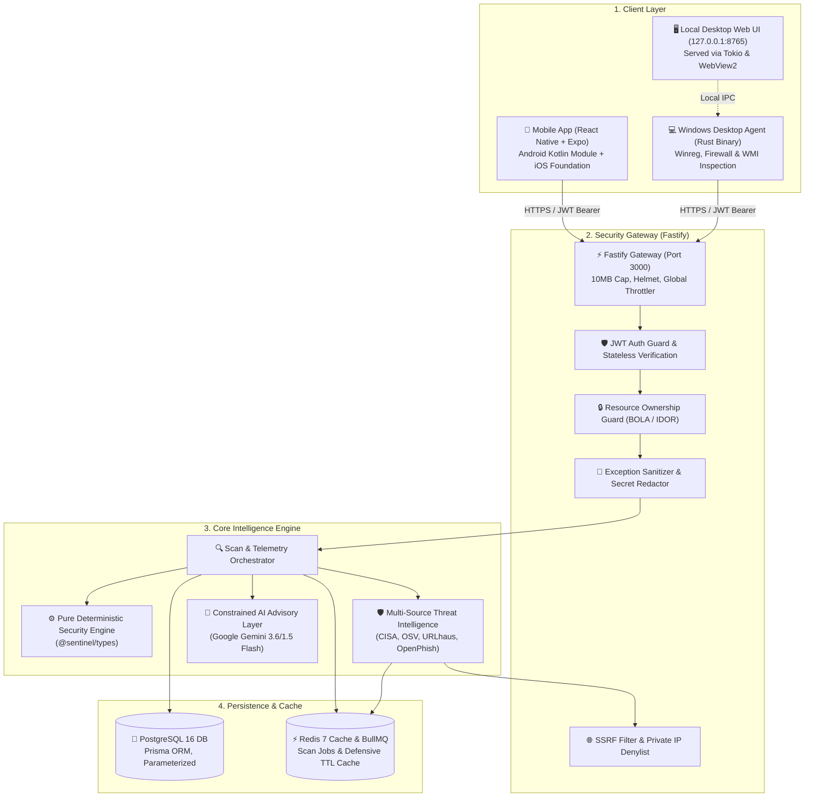

# Architecture Overview

> **Authoritative Baseline**: [SENTINEL_PROJECT_MASTER_DOCUMENTATION.md](../SENTINEL_PROJECT_MASTER_DOCUMENTATION.md)  
> **Product Specification**: [SENTINEL_PRD_v1.0.md](../../SENTINEL_PRD_v1.0.md)

---

## High-Level System Topology

Sentinel is architected as an enterprise-grade, privacy-first cybersecurity platform partitioned into four primary layers:



---

## Monorepo Workspaces

Sentinel is organized as a unified monorepo using **pnpm workspaces** and **Turborepo**:

| Package / Application | Technology                  | Role in Architecture                                                                                                   |
| :-------------------- | :-------------------------- | :--------------------------------------------------------------------------------------------------------------------- |
| `apps/backend`        | NestJS 11 + Fastify 5       | Core REST API gateway, authentication, scan orchestration, threat intelligence, and AI advisory services               |
| `apps/mobile`         | React Native 0.79 + Expo 53 | Cross-platform client app, custom design system, tab-based navigation, and native telemetry modules (Kotlin & Swift)   |
| `apps/desktop`        | Native Rust (Edition 2021)  | High-performance Windows security agent inspecting Registry, Firewall, BitLocker, and system health with a loopback UI |
| `packages/types`      | TypeScript 5.8              | Pure TypeScript engine containing deterministic scoring algorithms, rule evaluation, risk matrices, and API schemas    |

---

## API Architecture & Gateway

- **Protocol**: REST over HTTPS
- **Versioning**: URI-based path prefixing (`/api/v1/...`)
- **Interactive Documentation**: OpenAPI 3.0 / Swagger UI hosted at `/api/docs`
- **Performance Adapter**: Fastify HTTP engine with 10MB payload cap
- **Security Middleware**: Fastify Helmet (CSP, HSTS), NestJS Throttler rate limiting, and CORS restrictions

---

## Core Data & Evaluation Pipeline

```
[Device Telemetry Collection]
              │
              ▼
[Provenance Tagging & Normalization]
              │
              ▼
[Deterministic Security Engine (@sentinel/types)]
              │
              ├─────────────────────────────┐
              ▼                             ▼
[Mathematical Score (0-100)]     [Actionable Findings]
              │                             │
              └──────────────┬──────────────┘
                             ▼
              [Threat Intelligence Correlation]
              (CISA KEV, OSV, URLhaus, OpenPhish)
                             │
                             ▼
              [Constrained AI Advisory Layer]
              (Explanatory Markdown & Step-by-Step Guidance)
                             │
                             ▼
              [Encrypted Sync & Dashboard Presentation]
```

### Architectural Guarantees

1. **Scoring Invariance:** Security posture scores ($0-100$) are strictly governed by mathematical formulas in `@sentinel/types`. AI models never influence, bias, or override numeric scores.
2. **Provenance Integrity:** Telemetry signals explicitly state their trust level (`VERIFIED`, `ANALYZED`, `USER_PROVIDED`, `NOT_AVAILABLE`, `PERMISSION_REQUIRED`, or `UNABLE_TO_VERIFY`).
3. **Honest Posture:** Missing or sandbox-restricted telemetry is never penalized as insecure, nor is it falsely assumed to be secure.

For full technical specifications, see [docs/SENTINEL_PROJECT_MASTER_DOCUMENTATION.md](../SENTINEL_PROJECT_MASTER_DOCUMENTATION.md).
